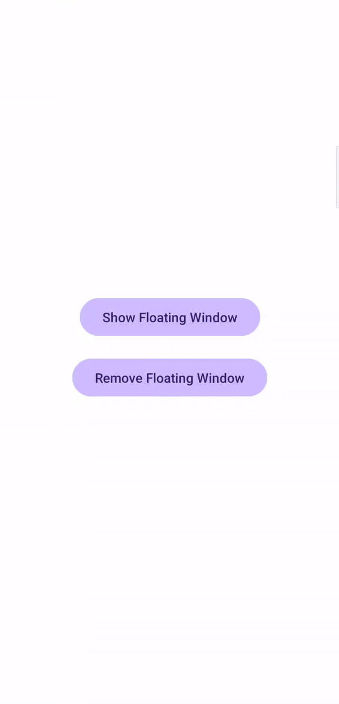

## Android Floating Window Screen (Kotlin)
[](https://kotlinlang.org/)
[](LICENSE)
[](#)
---

A lightweight, customizable Floating Window / Overlay library for Android, built in Kotlin, that allows apps to display draggable floating UI elements on top of other apps — similar to Chat Heads / Picture-in-Picture style windows.

### Features

- Floating window overlay using WindowManager
- Draggable in all directions (left, right, up, down)
- Close button built-in
- XML-based configuration (no duplicate config code)
- Rounded, modern UI
- Works with any custom layout
- Overlay permission handling included

---

### Preview

 

---

## Installation (JitPack)

### 1️⃣ Add JitPack to your **root `settings.gradle` or `build.gradle`**

```gradle
dependencyResolutionManagement {
    repositories {
        google()
        mavenCentral()
        maven { url 'https://jitpack.io' }
    }
}
```

### Add Dependency
```
	dependencies {
	        implementation 'com.github.Excelsior-Technologies-Community:Android_FloatingWindowScreen:1.0.1'
	}
```

---

### Basic Usage

Check Overlay Permission
```kotlin
if (!OverlayPermissionHelper.canDrawOverlays(this)) {
    OverlayPermissionHelper.requestPermission(this)
    return
}
```

Create Floating Window Layout (XML)
```xml
<com.ext.floatingwindow.ui.FloatingLayout
    xmlns:android="http://schemas.android.com/apk/res/android"
    xmlns:app="http://schemas.android.com/apk/res-auto"
    android:layout_width="240dp"
    android:layout_height="160dp"
    android:background="@drawable/bg_floating_card"
    app:fw_showClose="true"
    app:fw_draggable="true"
    app:fw_startY="200">

    <LinearLayout
        android:layout_width="match_parent"
        android:layout_height="match_parent"
        android:orientation="vertical">

        <TextView
            android:text="Floating Window"
            android:textSize="16sp"
            android:textStyle="bold"
            android:textColor="@android:color/white"/>

        <TextView
            android:text="Drag, close and customize"
            android:textColor="#CCFFFFFF"
            android:textSize="14sp"/>

    </LinearLayout>

</com.ext.floatingwindow.ui.FloatingLayout>
```

Show Floating Window (Kotlin)
```kotlin
val floatingView = layoutInflater.inflate(
    R.layout.view_floating_test,
    null
)

FloatingWindow(this).show(floatingView)
```

---

### Example Usage

Main XML
```xml
<?xml version="1.0" encoding="utf-8"?>
<LinearLayout
    xmlns:android="http://schemas.android.com/apk/res/android"
    android:orientation="vertical"
    android:gravity="center"
    android:id="@+id/main"
    android:background="@color/white"
    android:layout_width="match_parent"
    android:layout_height="match_parent">

    <Button
        android:id="@+id/btnShow"
        android:layout_width="wrap_content"
        android:layout_height="wrap_content"
        android:text="Show Floating Window"/>

    <Button
        android:id="@+id/btnRemove"
        android:layout_width="wrap_content"
        android:layout_height="wrap_content"
        android:text="Remove Floating Window"
        android:layout_marginTop="16dp"/>

</LinearLayout>
```

Custom UI for floating screen
```xml
<?xml version="1.0" encoding="utf-8"?>
<com.ext.floatingwindow.ui.FloatingLayout
    xmlns:android="http://schemas.android.com/apk/res/android"
    xmlns:app="http://schemas.android.com/apk/res-auto"
    android:layout_width="240dp"
    android:layout_height="160dp"
    android:background="@drawable/bg_floating_card"
    app:fw_showClose="true"
    app:fw_draggable="true">

    <LinearLayout
        android:layout_width="match_parent"
        android:layout_height="match_parent"
        android:orientation="vertical">

        <!-- HEADER -->
        <TextView
            android:id="@+id/txtTitle"
            android:layout_width="match_parent"
            android:layout_height="wrap_content"
            android:text="Floating Window"
            android:textColor="@android:color/white"
            android:textSize="16sp"
            android:textStyle="bold"
            android:paddingBottom="8dp"/>

        <!-- DIVIDER -->
        <View
            android:layout_width="match_parent"
            android:layout_height="1dp"
            android:background="#33FFFFFF"
            android:layout_marginBottom="8dp"/>

        <!-- CONTENT -->
        <TextView
            android:id="@+id/txtContent"
            android:layout_width="match_parent"
            android:layout_height="wrap_content"
            android:text="This floating window can be dragged, closed, and customized."
            android:textColor="#CCFFFFFF"
            android:textSize="14sp"/>

    </LinearLayout>

</com.ext.floatingwindow.ui.FloatingLayout>
```

Main Kotlin
```kotlin
class MainActivity : AppCompatActivity() {
    private var floatingWindow: FloatingWindow? = null
    override fun onCreate(savedInstanceState: Bundle?) {
        super.onCreate(savedInstanceState)
        enableEdgeToEdge()
        setContentView(R.layout.activity_main)
        ViewCompat.setOnApplyWindowInsetsListener(findViewById(R.id.main)) { v, insets ->
            val systemBars = insets.getInsets(WindowInsetsCompat.Type.systemBars())
            v.setPadding(systemBars.left, systemBars.top, systemBars.right, systemBars.bottom)
            insets
        }
        findViewById<Button>(R.id.btnShow).setOnClickListener {
            showFloatingWindow()
        }

        findViewById<Button>(R.id.btnRemove).setOnClickListener {
            floatingWindow?.dismiss()
        }
    }
    private fun showFloatingWindow() {

        if (!OverlayPermissionHelper.canDrawOverlays(this)) {
            OverlayPermissionHelper.requestPermission(this)
            return
        }

        val floatingView = layoutInflater.inflate(
            R.layout.view_floating_test,
            null
        )

        FloatingWindow(this).show(floatingView)
    }

}
```

---

### XML Attributes

| Attribute        | Type    | Description                         |
|------------------|---------|-------------------------------------|
| `fw_draggable`   | boolean | Enable or disable dragging           |
| `fw_showClose`   | boolean | Show or hide the close button        |
| `fw_startX`      | integer | Initial X position (in pixels)       |
| `fw_startY`      | integer | Initial Y position (in pixels)       |

---

### License

```
MIT License

Copyright (c) 2025 Excelsior Technologies 

Permission is hereby granted, free of charge, to any person obtaining a copy
of this software and associated documentation files (the "Software"), to deal
in the Software without restriction, including without limitation the rights
to use, copy, modify, merge, publish, distribute, sublicense, and/or sell
copies of the Software, and to permit persons to whom the Software is
furnished to do so, subject to the following conditions:

The above copyright notice and this permission notice shall be included in all
copies or substantial portions of the Software.

THE SOFTWARE IS PROVIDED "AS IS", WITHOUT WARRANTY OF ANY KIND, EXPRESS OR
IMPLIED, INCLUDING BUT NOT LIMITED TO THE WARRANTIES OF MERCHANTABILITY,
FITNESS FOR A PARTICULAR PURPOSE AND NONINFRINGEMENT. IN NO EVENT SHALL THE
AUTHORS OR COPYRIGHT HOLDERS BE LIABLE FOR ANY CLAIM, DAMAGES OR OTHER
LIABILITY, WHETHER IN AN ACTION OF CONTRACT, TORT OR OTHERWISE, ARISING FROM,
OUT OF OR IN CONNECTION WITH THE SOFTWARE OR THE USE OR OTHER DEALINGS IN THE
SOFTWARE.
```

